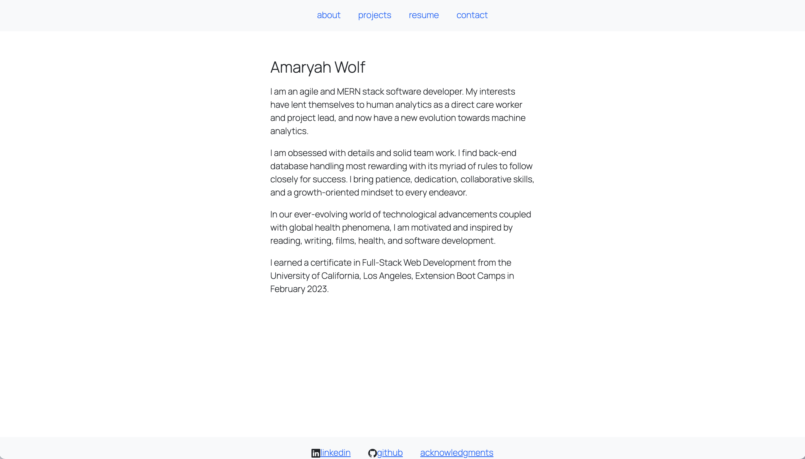

# Social Network API

## [Deployed Application](https://amaryahwolf.github.io/akw-portfolio/)
 
[](https://opensource.org/licenses/MIT)

## Description
This application is a single-page React application showcasing Amaryah Wolf's projects and technical skills. This application uses React, ReactDOM, Node.js and bootstrap.

## Table of Contents
- [Installation](#installation)
- [Usage](#usage)
- [Credits](#credits)
- [License](#license)
- [Contributing](#contributing)
- [Tests](#tests)
- [Questions](#questions)

## Installation
To run the application, simply enter the URL in any browser. <br>
To install the application locally, ensure that [Node.js](https://nodejs.org/en/download/) is installed, then clone the repository from Github and run the installation script ```npm run install``` followed by the start script ```npm run start```.

## Usage
To explore the application, use the navigation bar at the top of the page to browse Amaryah's bio, projects, and resume (downloadable). You may also use the links at the footer to browse Amaryah's LinkedIn, GitHub and acknowledgments regarding the application.


## Credits
Collaborators: Amaryah Wolf

## License
This application is covered under the MIT license.

## Contributing
[Contributor Covenant](https://www.contributor-covenant.org/version/2/1/code_of_conduct/)

## Tests
N/A

## Questions
For additional questions, find me on [github](https://github.com/amaryahwolf) or email me at amaryahwolf@gmail.com.